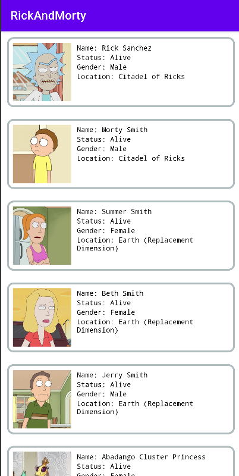

# RickAndMortyApi

Приложение для работы с The Rick and Morty API.

## Стек:
1. Kotlin
2. Retrofit
3. MVVM
4. RecyclerView
5. LiveData
6. Clean architecture 

TODO:
Убрать запрос в сеть из ViewModel

 
